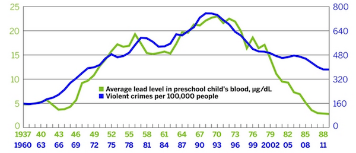

## 
* Lead poisoning has been shown to correlate with violent crime with a lag time of many years
 
* Most lead poisoning occurs in a relatively small number of urban neighborhoods built before 1950 containing lead paint.  

* Goal: Create a Shiny app to spatially explore lead exposure rates with other public data, such as violent crime, with different lag times

## Suboptimal data from wonder.cdc.gov

* Corresponding CSV files not consistent with XLS files
* Sporadic empty columns, inconsistent spacing
* Indistinct column names
* Data is summarized as percentage -- not raw

 

## Dealing with "suboptimal" data

* We (Nabil) ceated an R package for parsing CDC's "wonder" health data (http://wonder.cdc.gov)
* This package resolves numerous problems with the files 
    + 
* composable (i.e., "chain-able") functions which extract variables of interest 
* Available on github  
[https://github.com/yxes/jhudash-leadteam](https://github.com/yxes/jhudash-leadteam) 

## Shiny App: Lead Times for Lead

```{r, echo=FALSE}
library(leaflet)
library(maps)
library(RColorBrewer)

#colors <- heat.colors(20)
# First create color scale.
    #breaks    <- seq(-1,1,0.1)
    #numBreaks <- length(breaks)

    colors <- rep("",20)
    for ( i in 1:20 ) {
        redVal   <- (i-1)/19
        blueVal  <- 1 - redVal
        greenVal <- 0
        colors[i]   <- rgb(redVal,greenVal,blueVal)
    }
#colors <- rep("red",20)
#colors <- topo.colors(20, alpha=1)
#colors <- substring(colors,1,7)

lead=read.csv("./StateConfirmedByYear_1997_2013_03042015.csv")
stateConversions=read.csv("StateConversions.csv")
homicide_wide=read.csv("./homicide_wide.csv")
suicide_wide=read.csv("./suicide_wide.csv")

shiftedCorr <- function(dataFrame1,dataFrame2,colName1="PctConfirmedBllGT10",colName2="Overall",yearDelta=0,stateConv) {
  dataFrame1$State <- as.character(dataFrame1$State)
  dataFrame2$State <- as.character(dataFrame2$State)
  dataFrame1$Year=dataFrame1$Year+yearDelta
  mergeDF<-merge(dataFrame1,dataFrame2,by=c('Year', 'State'))
  mergeDF <- mergeDF[,c("Year","State",colName1,colName2)]
  mergeDF <- na.omit(mergeDF)
  stateLIST <- unique(mergeDF$State)
  numStates <- length(stateLIST)
  leadCrimeCorr <- NULL
  for ( s in 1:numStates ) {
#    print(s)
    theState <- stateLIST[s]
    subDF <- mergeDF[ mergeDF$State == theState, ]
    if ( nrow(subDF) > 0 ) {
    subDF2 <- stateConv[ stateConv$State == tolower(theState), ]
    subDF2$Corr <-cor(subDF[,colName1], subDF[,colName2], use="complete.obs")
    leadCrimeCorr <- rbind(leadCrimeCorr,subDF2)
  }
  }
  return(leadCrimeCorr)
}

inputPanel({
  radioButtons("datasource", "behavior",
             c("Homicide" = "homicide",
               "Suicide" = "suicide"))
},{
 sliderInput("delta", "Delta:", 
                min = 0, max = 4, value = 0, step=1)
})

renderLeaflet({
  datasource <- NULL
  if (input$datasource == "homicide") {
    datasource = homicide_wide
  }else if (input$datasource == "suicide") {
    datasource = suicide_wide
  }
  
  data = shiftedCorr(lead, datasource, "PctConfirmedBllGT10","Overall",input$delta,stateConversions)
  data$CorrInt <- ceiling(data$Corr*10 + 10)
  data$Color <- colors[ data$CorrInt ]
  mapStates = map("state", fill=TRUE, plot=TRUE)

  state_names <- mapStates$names
  
 state_col <- rep("#FFFFFF", length(state_names))
 names(state_col) <- state_names
#  state_col["nebraska"] <- "#00FF00"
#  names(state_col) <- NULL
  
  stateLIST <- as.character(data$OLDSTATE)
  numStates <- length(stateLIST)

  popup_col <- rep('', length(state_names))
  names(popup_col) <- state_names
  
  for ( i in 1:numStates ) {
    theState <- stateLIST[i]
    theColor <- data$Color[ data$OLDSTATE == theState ]
    state_col[ theState ] <- theColor
    popup_col[ theState ] <- paste("Correlation:", data$Corr[ data$OLDSTATE == theState ])
  }
  names(state_col) <- NULL
  #print(state_col)
  

#  popup_col["nebraska"] <- "Nebraska"
  names(popup_col) <- NULL
  
  m = leaflet(data = mapStates) %>%
        addTiles() %>%
        addPolygons(fillColor = state_col, stroke = FALSE,
                    popup=popup_col)
  #                  popup=as.character(1:63))
  
  
  #addPolygons(fillColor = state_col, stroke = FALSE)
  
  #addPolygons(fillColor = topo.colors(10, alpha = NULL), stroke = FALSE)
        #print(heat.colors(50, alpha = NULL))
        
  return(m)
})
```

## Summary
* Created an R package for parsing Excel Data 
* Create a Shiny App to display correlations by state with different lag times
* Used Leaflet for geographic rendering
* Shiny App is running inside a Shiny slide presentation

### Future Directions

* Additional measures
* Multiparameter models
* County or zipcode level
* NHANES


